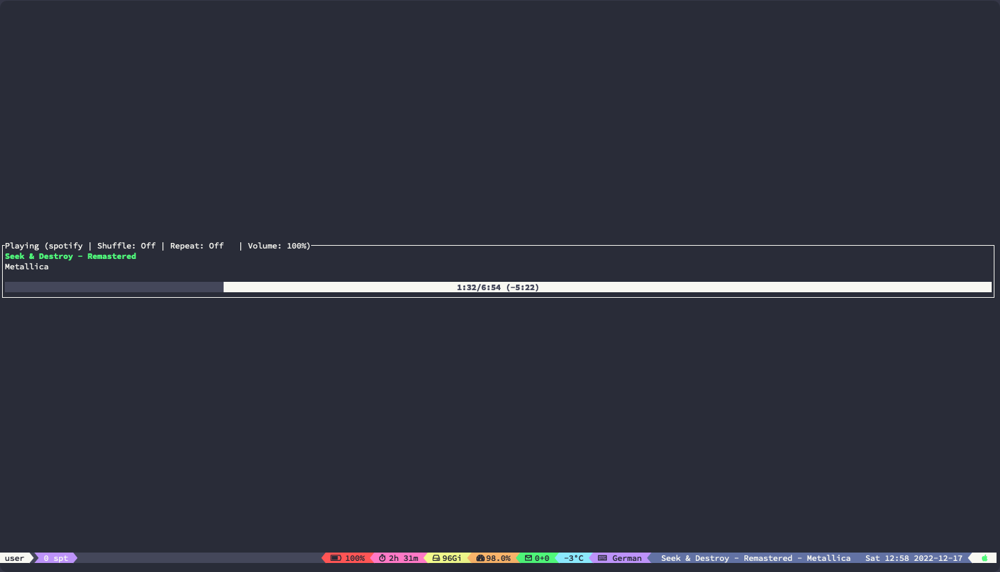

# Tmux Spotify-TUI plugin

Plugin that shows current playing song with [Spotify-TUI](https://github.com/Rigellute/spotify-tui).



### Recommendation

To see all the extra characters I recommend to use a [nerdfont](https://www.nerdfonts.com/#home)

### Usage

```tmux.conf
set -g status-right '#{actual_song}'
```

### Installation with Tmux Plugin Manager

Add plugin to the list of TPM plugins:

```tmux.conf
set -g @plugin 'alexchaichan/tmux-spotify-tui'
```

Press prefix + I to install it.

### Manual Installation (recommended)

Clone the repo:

```bash
$ git clone https://github.com/alexchaichan/tmux-spotify-tui.git ~/clone/path
```

Add this line to your .tmux.conf:

```tmux.conf
run-shell ~/clone/path/actual_song.tmux
```

Reload TMUX environment with:

```bash
$ tmux source-file ~/.tmux.conf
```

or:

Press prefix + R to install it.

### Configurations

**For tmux user**

Bind `F7`, `F8`, `F9` to prev, toggle, next

```
bind-key -n F7 run-shell "spt playback --previous >/dev/null 2>&1"
bind-key -n F8 run-shell "spt playback --toggle >/dev/null 2>&1"
bind-key -n F9 run-shell "spt playback --next >/dev/null 2>&1"
```

If you are a **Mac user**, you might be interested in unlinking the media buttons to prevent `Music.app` from opening.

`launchctl unload -w /System/Library/LaunchAgents/com.apple.rcd.plist`

___

### License

[MIT](LICENSE)
